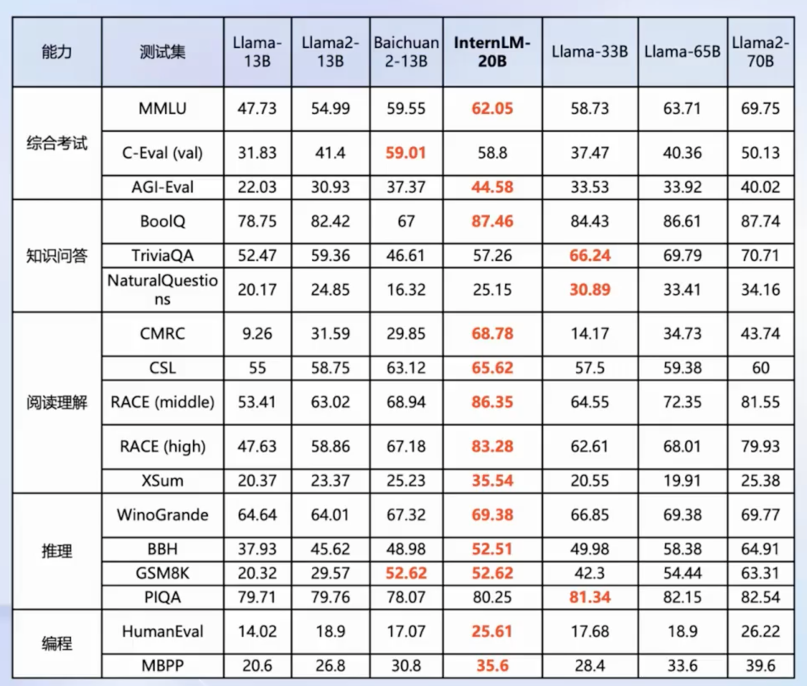
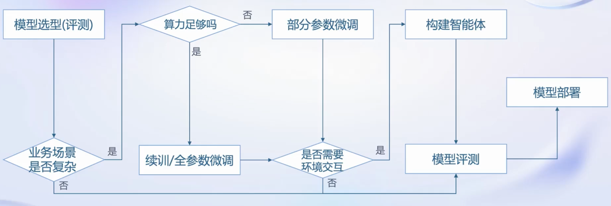
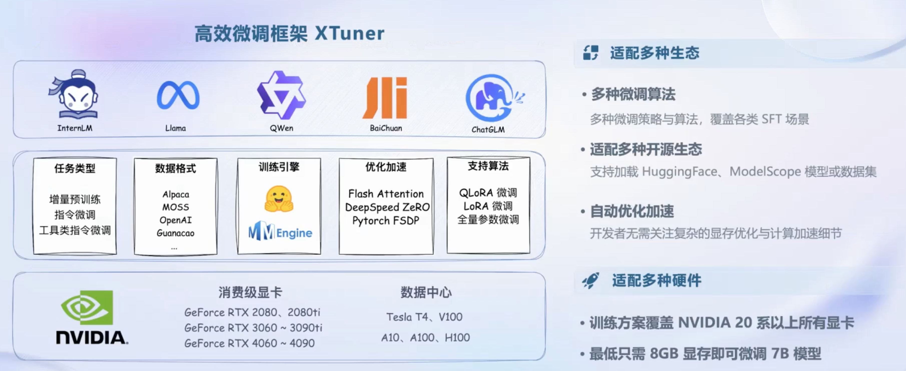
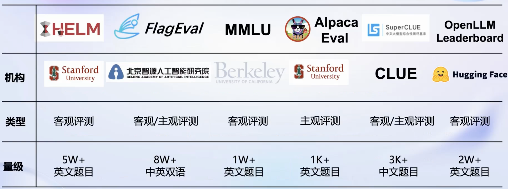
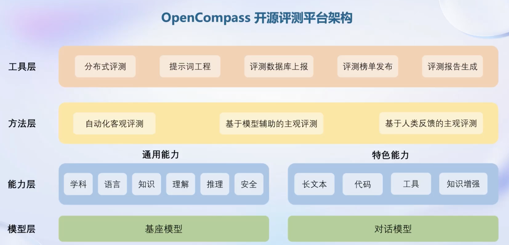
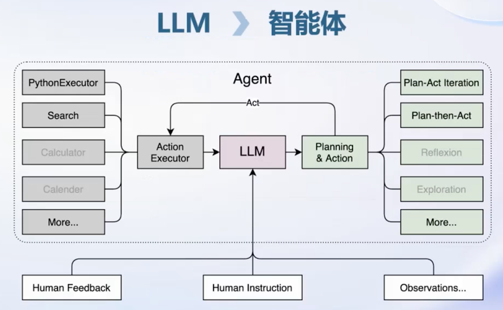

[TOC]

#### 书生·浦语大模型包含三大类：

- 轻量级：InternLM-7B，社区低成本可用最佳模型规模。
- 中量级：InternLM-20B，商业场景可开发定制高精度较小模型规模。
- 重量级：InternLM-123B，通用大语言模型能力全面覆盖千亿模型规模。

#### 书生*浦语20B开源大模型性能

​	全面领先相近量级的开源模型（包括Llama-33B、Llama2-13B以及国内主流的7B、13B开源模型）以不足三分之一的参数量达到Llama2-70B水平

#### 从模型到应用：

# 书生*浦语全链条开源开放体系

- **数据**：书生*万卷，2TB数据，涵盖多种模态与任务
- **预训练**：InternLM-Train，并行训练，极致优化，速度达到 3600 tokens/sec/gpu
- **微调**：XTuner，支持全参数微调，支持LoRA等低成本微调
- **部署**：LMDeploy，全链路部署，性能领先，每秒生成 2000+ tokens
- **评测**：全方位评测，性能可复现，80套评测集，40万道题目
- **应用**：Lagent AgentLego，支持多种智能体，支持代码解释器等多种工具。

#### 1、数据

- 文本数据
  - 50亿个文档
  - 数据量超1TB
- 图像-文本数据集
  - 超2200万个文件
  - 数据量超140GB
- 视频数据
  - 超1000个文件
  - 数据量超900GB

| 多模态融合                                                   | 精细化处理                                                   | 价值观对齐                                                   |
| ------------------------------------------------------------ | ------------------------------------------------------------ | ------------------------------------------------------------ |
| 万卷包含文本、图像和视频等多模态数据。涵盖科技、文学、媒体、教育和法律等多个领域。该数据集对模型的知识内容、逻辑推理和泛化能力的提升有显著的效果 | 万卷经过语言筛选、文本提取、格式标准化、数据过滤和清洗（基于规则和模型）、多尺度去重和数据质量评估等精细数据处理环节，能够很好地适应后续模型训练的要求 | 在万卷的构建过程中，研究人员注重将数据内容与主流中国价值观进行对齐，并通过高算法和人工评估的结合提高语料库的纯净度。 |

补充：[Opendatalab](https://opendatalab.com/)提供开放数据

#### 2、预训练

- 高可扩展：支持从8卡到千卡训练，千卡加速效率达92%
- 极致性能优化：Hybrid Zero独特技术 + 极致优化，加速50%
- 兼容主流：无缝接入 HuggingFace 等技术生态，支持各类轻量化技术
- 开箱即用：支持多种规格语言模型，修改参数配置即可训练

#### 3、微调

- 增量续训
  - 使用场景：让基座模型学习到一些新知识，如某个垂类领域知识
  - 训练数据：文章、书记、代码等
- 有监督微调：
  - 使用场景：让模型学会理解和遵循各种指令，或者注入少量领域知识
  - 训练数据：高质量的对话、问答数据

#### 4、评测

##### OpenCompass：

全方位评测，性能可复现。80 套评测集，40 万道题目。

6 大维度：

1. 学科：初中考试、中国高考、大学考试、语言能力考试、职业资格考试
2. 语言：字词释义、成语习语、语义相似、指代消解、翻译
3. 知识：知识问答、多语种知识问答
4. 理解：阅读理解、内容分析、内容总结
5. 推理：因果推理、常识推理、代码推理、数学推理
6. 安全：偏见、有害性、公平性、隐私性、真实性、合法性

#### 5、部署

- 大语言模型特点：
  - 内存开销巨大
    - 庞大的参数量
    - 采用自回归生成token，需要缓存k/v
  - 动态Shape
    - 请求数不固定
    - token逐个生成，且数量不定
  - 模型结构相对简单
    - Transformer结构，大部分是decoder-only
- 技术挑战
  - 设备
    - 低存储设备（消费级显卡、移动端等）如何部署？
  - 推理
    - 如何加速token的生成速度
    - 如何解决动态shape，让推理可以不间断
    - 如何有效管理和利用内存
  - 服务
    - 提升系统整体吞吐量
    - 降低请求的平均响应时间
- 部署方案
  - 技术点
    - 模型并行
    - 低比特量化
    - Attention优化
    - 计算和访存优化
    - Continuous Batching

##### LMDeploy:

全链路部署，性能领先，每秒生成 2000+ tokens。提供大模型在 GPU 上部署的全流程解决方案，包括模型轻量化、推理和服务。

- 接口：Python, gRPC, RESTful
- 轻量化：4bit 权重、8bit k/v
- 推理引擎：turbomind, pytorch
- 服务：openai-server, gradio, triton inference server

#### 6、智能体

大语言模型的局限性：

- 最新信息和知识的获取
- 回复的可靠性
- 数学计算
- 工具使用和交互

Lagent 是一种轻量级智能体框架：

- 支持多种类型的智能体能力，如 ReAct, ReWoo, AutoGPT
- 灵活支持多种大语言模型，如 OpenAI 的 GPT-3.5/4, 上海人工智能实验室的 InternLM, Hugging Face 的 Transformers, meta 的 Llama
- 简单易拓展，支持丰富的工具，如 AI 工具（文生图、文生语音、图片描述），能力拓展（搜索，计算器，代码解释器）， Rapid API（出行 API， 财经 API， 体育咨询 API）

#### 多模态智能体工具箱AgentLego

- 丰富的工具集合，尤其是提供了大量视觉、多模态相关领域的前沿算法功能
- 支持多个主流智能体系统，如 Lagent, LangChain, Transformers Agent 等
- 灵活的多模态工具调用接口，可以轻松支持各类输入输出格式的工具函数
- 一键式远程工具部署，轻松使用和调试大模型智能体
